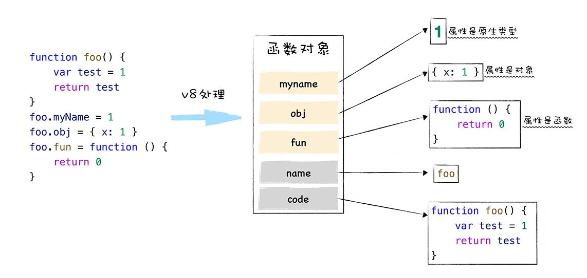

JavaScript中的函数就**是一种特殊的对象**, 我们把Javascript中的函数称为**一等公民**;  

## js中的对象与面向对象语言中的“对象”有什么区别  
1. js中的对象  
&ensp;&ensp;js是一门**基于对象(Object-Based)**的语言, 对象在运行时可以动态修改其内容;虽然js是基于对象设计的, 但它不是一门**面向对象(Object-Oriented Programming Language**的语言;在js中, 对象就是由一组组属性和值构成的集合;
2. 面向对象语言  
&ensp;&ensp;面向对象语言天生支持封装、继承、多态.面向对象语言本身对继承做了充分的支持, 并提供了大量的关键字, 如public、protected、friend、interface等, 众多的关键字使得面向对象语言的继承变得异常繁琐和复杂.  
 
js并没有直接提供多态的支持, 实现继承的方式也非常简单, **只是在对象中添加了一个称为原型链的属性, 把继承的对象通过原型链连接起来, 就实现了继承, 我们把这种继承方式称为基于原型链的继承**.  
 
对象的属性值  
- 原始类型(primitive): 指本身无法被改变, 比如js中的字符串, 如果修改了js中的字符串, 那么v8会返回一个新的字符串, 原始字符串并没有被改变;js中的原始值主要包括null、undefined、boolean、number、string、bigint、symbol这七种.   
- 对象类型(Object): 对象的属性值也可以是另外一种对象  
- 函数类型(Function): 如果对象中的属性值是函数, 那么我们把这个属性称为方法, 所以我们说对象具备属性和方法.  
   
### 函数的本质  
在v8内部, 会为函数对象添加两个隐藏属性, 分别为name属性和code属性:  
- name属性的值是函数名称, 如果某个函数没有设置函数名, 该函数对象的默认的name属性值就是anonymous, 表示该函数对象没有被设置名称;  
- code属性的值表示函数代码, 一字符串的形式存储在内存中.当执行到一个函数调用语句时, v8便会从函数对象中取出code属性值, 也就是函数代码, 然后再解释执行这段代码.  

### 函数是一等公民
如果某个编程语言的函数, 可以和这个语言的数据类型做一样的事情, 我们就把这个语言中的函数称为一等公民.  

