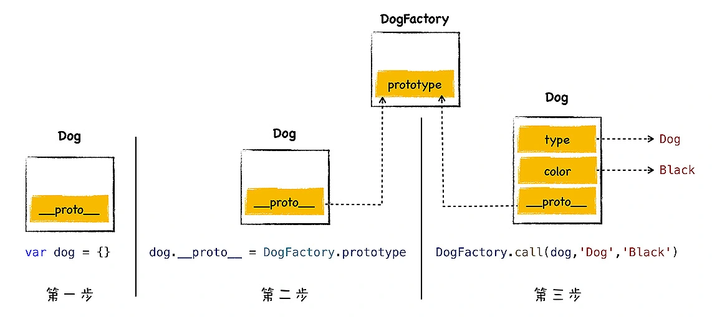

## 继承  
继承就是一个对象可以访问另外一个对象中的属性和方法.  
不同语言实现继承的方式不同, 其中最典型的两种方式是**基于类的设计**和**基于原型链的设计** 
C++、Java、C#这些语言都是基于经典的类继承的设计模式; Js是基于原型链的设计.  
### 原型链继承是如何实现的
  
javascript的每个对象都包含了一个隐藏属性__proto__, 我们就把该隐藏属性称之为该对象的原型(prototype), __proto__指向了内存中的另外一个对象, 我们就把__proto__指向的对象称之为该对象的**原型对象**, 那么该对象可以直接访问其原型对象的方法或属性.  

**在js中, 我们通过原型和原型链的方式实现了继承特性**  
通常隐藏属性是不能使用js来直接与之交互的, 虽然现代浏览器都开了口子, 让js可以访问隐藏属性__proto__, 但是在实际项目中, 我们不应该直接通过__proto__来访问或者修改该属性, 其主要原因有两个:  
- 隐藏属性并不是标准定义的;  
- 使用该属性会造成严重的性能问题;  

### 构造函数创建对象  
  
1. 创建了空白对象dog;  
2. 将DogFactory的prototype属性设置为dog的原型对象, 这是给dog对象设置原型对象的关键一步;; 
3. 使用dog来调用DogFactory, 这是dogFactory中的this指向了对象dog, 然后在dogFactory函数中, 利用this对对象dog执行属性填充操作, 最终创建对象dog.  
   
### 构造函数实现继承  
每个函数对象中都有一个公开的prototype属性, 当你将这个函数作为构造函数来创建一个新的对象时, 新创建对象的原型对象就只想说了该函数的prototype属性. 如果只是正常调用函数, 那么prototype属性将不起作用.  