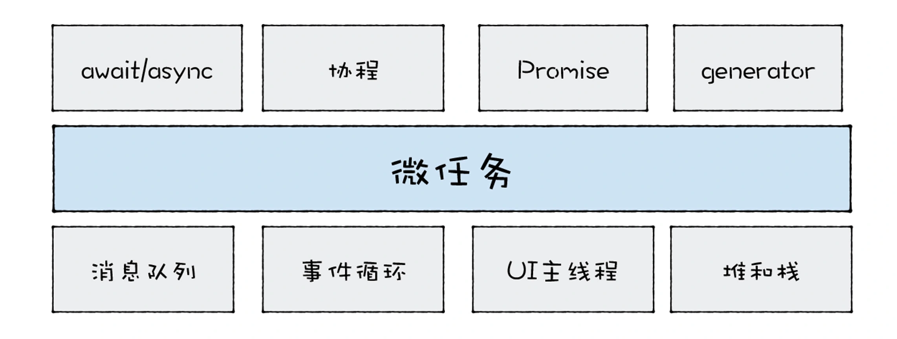

### 宏任务
宏任务是指消息队列中的等待被主线程执行的事件.每个宏任务执行的时候, V8都会重新创建栈, 然后随着宏任务中函数调用, 栈也随之变化, 最终, 当该宏任务执行结束时, 整个栈又会被清空, 接着主线程继续执行下一个宏任务.  

### 微任务
可以把微任务看成是一个需要异步执行的函数, 执行时机是在主函数执行结束之后, 当前宏任务结束之前.  
<br>
js中引入微任务, 主要是由于主线程执行消息队列中宏任务的时间颗粒度太粗了, 无法胜任一些对进度和实时性要求较高的场景, **微任务可以在实时性和效率之间做一个有效的权衡**. 另外使用微任务, 可以改变我们现在的异步编程模型, 使得我们可以使用同步形式的代码来编写异步调用.  

  
从图中可以看出, 微任务是基于消息队列、事件循环、UI主线程还有堆栈而来的, 然后基于微任务, 又可以延伸出协程、Promise、Generator、await/async等现代前端经常使用的一些技术.  

### 主线程、调用战
调用战是一种数据结构, 用来管理在主线程上执行的函数的调用关系  
由于栈空间在内存中是连续存在的, 所以通常我们都会限制调用栈的大小, 如果当函数嵌套层数过深时, 过多的执行上下文堆积在栈中便会导致栈溢出.  
我们可以使用setTimeout来解决栈溢出的问题, setTimeout的本质是将同步函数调用改成异步函数函数调用, 这里的异步调用是将函数封装成事件, 并将其添加进消息队列中, 然后主线程再按照一定规则循环地从消息队列中读取下一个任务. 


### 微任务解决了宏任务执行时机不可控的问题  
V8会为每个宏任务维护一个微任务队列. 当V8执行一段js代码时, 会为这段代码创建一个环境对象, 微任务队列就是存放在该环境对象中的. 当你通过Promise.resolve生成一个微任务, 该微任务会被V8自动添加进微任务队列, 等整段代码快要执行结束时, 该环境对象也随之被销毁, 但是在销毁之前, V8会先处理微任务队列中的微务.

1. 如果当前的任务中产生了一个微任务, 通过Promise.resolve()或者Promise.reject都会触发微任务, 触发的微任务不会在当前的函数中被执行, 所以执行微任务时, 不会导致栈的无限扩张.  
2. 和异步调用不同, 微任务依然会在当前任务执行结束之前被执行, 这也就意味着在当前微任务执行结束之前, 消息队列中的其他任务是不可能被执行的.  
<br>
在函数内部触发的微任务, 一定比在函数内部触发的宏任务要优先执行.  

微任务是在当前的任务快要执行结束之前执行的, 宏任务是消息队列中的任务, 主线程执行完一个宏任务之后, 便会接着从消息队列中取出下一个宏任务并执行.  

### 在微任务中循环地触发新的微任务
```
function foo() {
    return Promise.resolve().then(foo);
}
```
当执行foo函数时, 由于foo函数调用了Promise.resolve(), 这会触发一个微任务, 那么此时, V8会将该微任务添加进微任务队列中, 退出当前foo函数的执行.  
然后, V8在准备退出当前的宏任务之前, 会检查微任务队列, 会发现微任务队列中有一个微任务, 于是先执行微任务. 由于这个微任务就是调用foo函数本身, 所以在执行微任务的过程中, 需要继续调用foo函数, 在执行foo函数的过程中, 又会触发了同样的微任务.  
那么这个循环就会一直持续下去, 当前的宏任务无法退出, 也就意味着消息队列中其他的宏任务是无法被执行的, 比如通过鼠标、键盘所产生的事件. 这些事件会一直保存在消息队列中, 页面无法响应这些事件, 具体的体现就是页面的卡死. 

不过由于V8枚次执行微任务时, 都会退出当前foo函数的调用栈, 所以这段代码是不会造成栈溢出的.  


