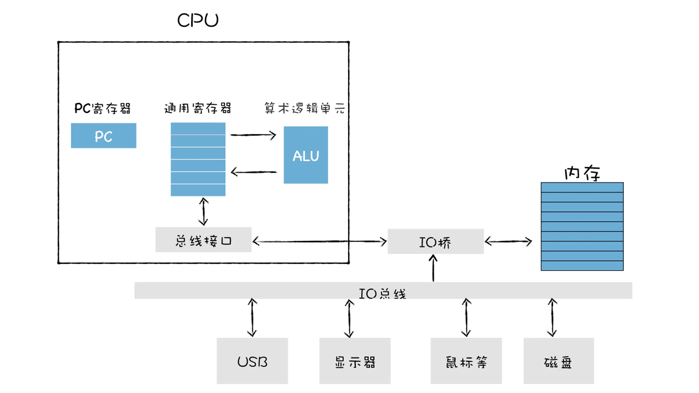

 
通常我们将汇编语言编写的程序转换为机器语言的过程称为“**汇编**”; 反之, 机器语言转化为汇编语言的过程称为“**反汇编**”.  

### CPU是怎么执行程序的   
  
这张图是比较通用的系统硬件组织模型图, 从图中我们可以看出, 它主要由CPU、主存储器、各种IO总线, 还有一些外部设备, 诸如硬盘、显示器、USB等设备组成.  

**首先,在程序执行之前, 我们的程序需要被装进内存**, 比如在windows下面, 你可以通过点击一个执行文件, 当你点击该执行文件的时候, 系统中的程序加载器会将该文件加载到内存中.  

**什么是内存**  
可以把内存看成是一个快递柜, 比如当你需要寄件的时候, 可以打开快递柜中的第100号单元格, 并存放你的物品, 有时候你会收到快递, 提示你的快递在快递柜的105号单元格中;  
这里有三个重要的内容, 分别是快递柜、快递柜中的每个单元格的编号、操作快递柜的人, 你可以把它们对比成计算机中的**内存**、**内存地址**、和**cpu**.  

CPU可以通过指定内存地址, 从内存中读取数据, 或者往内存中写入数据, 有了内存地址, CPU和内存就可以有序地交互.  

内存还是一个临时存储数据的设备, 之所以是临时的存储器, 是因为断电之后, 内存中的数据都会消失.  

内存中的每个存储空间都有其对应的独一无二的地址. 在内存中, 每个存放字节的空间都有其唯一的地址, 而且地址是按照顺序排放的.  

一旦二进制代码被装载进内存, CPU便可以从内存中取出一条指令, 然后分析该指令, 最后执行该指令.  
我们把取出指令、分析指令、执行指令这三个过程称为一个**CPU时钟周期**.  

CPU中有一个PC寄存器, 它保存了将要执行的指令地址, 当二进制代码中的第一条指令的地址写入到PC寄存器中, 到了下一个时钟周期时, CPU便会根据PC寄存器中的地址, 从内存中取出指令.  

pc寄存器中的指令取出来之后, 系统要做两件事:  
- 第一件事是将下一条指令的地址更新到pc寄存器中;  
- 更新了pc寄存器之后, cpu会立即做第二件事: 指令分析, 以及各种获取操作数的方法.  

在指令分析完成之后, 就要执行指令了, 要了解cpu如何执行指令的, 需要了解cpu中的一个重要部件: **通用寄存器**  

通用寄存器是CPU中用来存放数据的设备, 不同处理器中寄存器的个数也是不一样的, 之所以要通用寄存器, 是因为CPU访问内存的速度很慢, 所以CPU就在内部添加了一些存储设备, 这些设备就是通用寄存器

**通用寄存器容量小, 读写速度快, 内存容量大, 读写速度慢**;  

通用寄存器常用来存放数据或者内存中某块数据的地址, 我们把这个地址又称为指针, 通常情况下寄存器存放的数据是没有特别的限制的, 比如某个通用寄存器既可以存储数据, 也可以存储指针.  

不过由于历史原因, 我们还会将某些专用的数据或者指针存储在专用的通用寄存器中, 比如rbp寄存器通常用来存放栈帧指针, rsp寄存器用来存放栈顶指针, pc寄存器用来存放下一条要执行的指令.  

### 指令类型  
1. **加载指令**: 作用时从内存中复制指定长度的内容到通用寄存器中, 并覆盖寄存器中原来的内容.  
2. **存储的指令**: 和加载类型的指令相反, 其作用是将寄存器中的内容复制内存某个位置, 并覆盖掉内存中的这个位置上原来的内容.  
3. **更新指令**: 其作用是复制两个寄存器中的内容到ALU中, ALU将两个字相加, 并将结果存放在其中的一个寄存器中, 并覆盖掉该寄存器中的内容.  
4. **跳转指令**: 从指令本身抽取一个字, 这个字是下一条要执行的指令的地址, 将该字复制到pc寄存器中, 并覆盖掉pc寄存器中 原来的值.那么当执行下一条指令时, 便会跳转到对应的指令了.  

