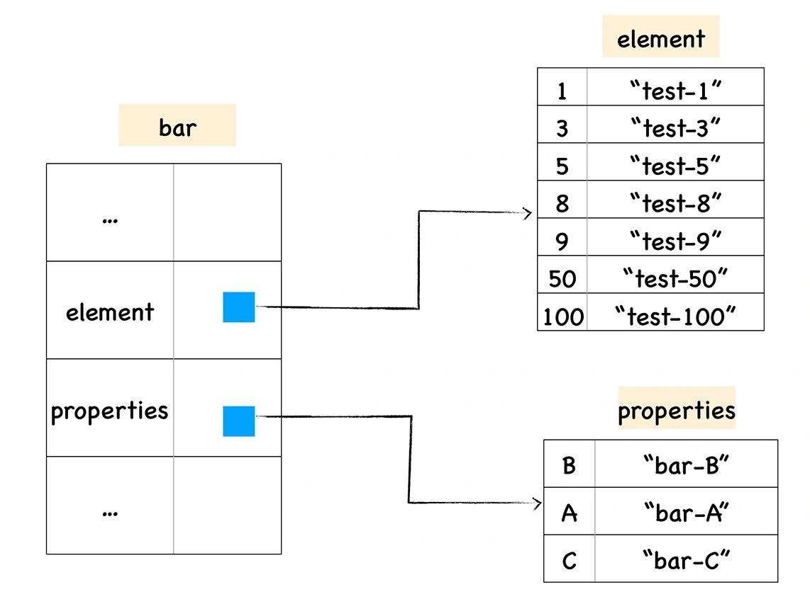
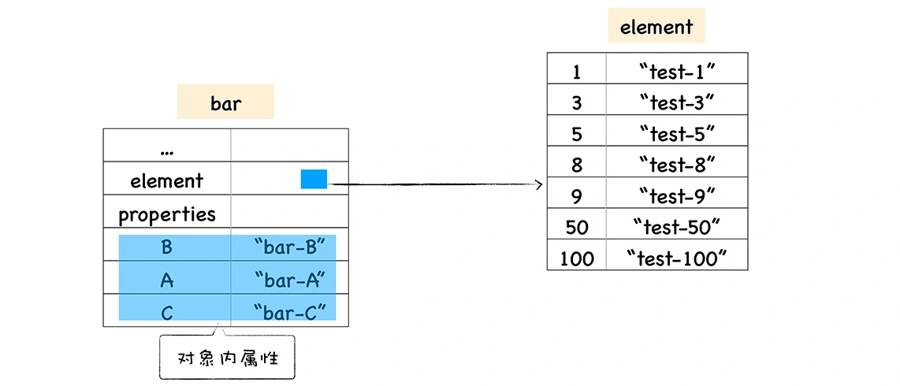
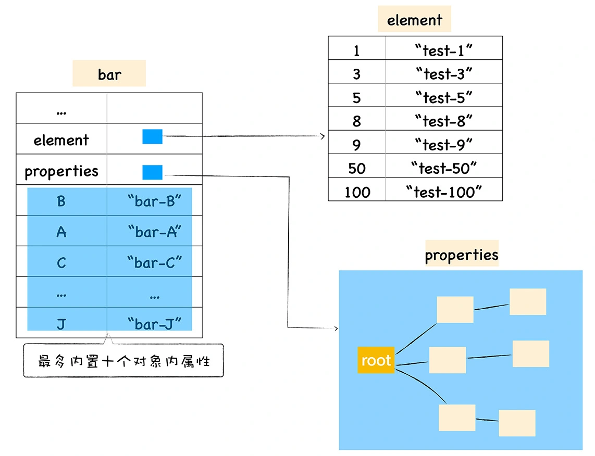

## 常规属性(properties)和排序属性(element)  
在ECMAScript中定义了**数字属性应该按照索引值大小升序排列, 字符串属性根据创建时的顺序升序排列.**  
在这里我们把对象中的数字属性称为**排序属性**, 在v8中被称为elements, 字符串属性被称为**常规属性**, 在v8中被称为properties.  
 
在v8内部, 为了有效提地提升存储和访问这两种属性的性能, 分别是用了两个**线性数据结构**来分别保存排序属性和常规属性:  
  

分解成这两种线性数据结构之后, 如果执行索引操作, 那么v8会先从elements属性中按照顺序读取所有的元素, 然后再在properties属性中读取所有的元素, 这样就完成一次索引操作.  

## 快属性和慢属性  
将不同的属性分别保存到elements属性和properties属性中, 无疑简化了程序的复杂度, 但是在查找元素时, 却多了一步操作, 比如执行bar.B这个语句来查找B的属性值, 那么在V8会先查找出properties属性所指向的对象properties, 然后再在properties对象中查找B属性;  
基于这个原因, v8采取了一个权衡的策略以加快查找属性的效率, 这个策略是将部分常规属性直接存储到对象本身, 我们把这称为**对象内置属性(In-Object properties)**. 对象在内存中的展现形式可参看下图: 
  
采用对象内置属性后, 常规属性就被保存到bar对象本身了, 这样当再次使用bar.B来查找B属性值时, V8可以直接从bar对象本身去获取该值, 这种方式减少查找属性值的步骤, 增加了查找效率.  
内置对象的数量是固定的, 默认是10个, 如果添加的属性超出了对象分配的空间, 则它们将被保存在常规属性存储中
   
通常, 我们将保存在线性数据结构中的属性称为“快属性”, 因为线性数据结构中只需要通过索引即可以访问到属性, 虽然访问线性结构的速度快, 但是如果从线性结构中添加或者删除大量的属性时, 则执行效率会非常低, 这主要因为会产生大量时间和内存开销.  
  因此, 如果一个对象属性过多时, v8就会采取另外一种存储策略, 那就是“慢属性”策略, 但慢属性的对象内部会有独立的非线性数据结构(词典)作为属性存储容器.所有的属性元信息不再是线性存储的,而是直接保存在属性字典中. 
  

