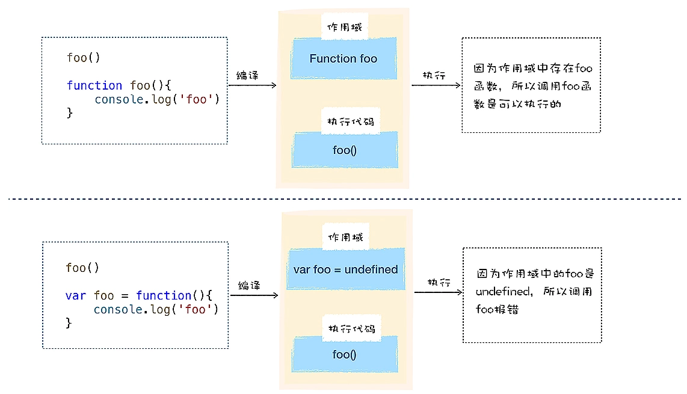
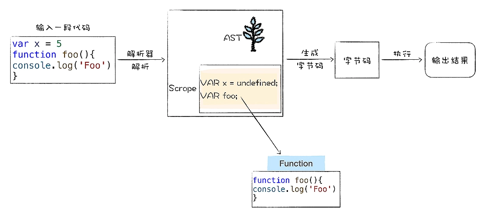

## 函数声明与函数表达式的差异  
  
<br/>
 ## V8是怎么处理函数声明的
   
 在编译阶段如果解析到函数声明, 那么V8会将这个函数声明转换为内存中的函数对象, 并将其放到作用域中.同样, 如果解析到了某个变量声明, 也会将其放到作用域中, 但是会将其设置为undefined, 表示该变量还未被使用.  
 在执行阶段, 如果使用了某个变量或者调用了某个函数, 那么V8会去作用域查找相关内容.  
<br>
变量提升
在编译阶段, 将把所有变量提升到作用域的过程称为**变量提升**  
声明的函数在编辑阶段就被提升到作用域中, 在执行阶段, 只要是在作用域中存在的变量或者对象, 都是可以使用的. 
<br>  
对于变量提升, 函数和普通的对象还是存在一些差异的; 如果是一个普通变量, 变量提升之后的值都是undefined, 如果是声明的函数, 那么变量提升之后的值则是函数对象.  
<br>
表达式是表示值的式子, 而语句是操作值的式子; 执行表达式返回的是值, 执行语句不会返回任何值.**表达式是不会在编译阶段执行的**  
函数是一个对象, 所以在编译阶段, V8就会将整个函数对象提升到作用域中, 并不是给该函数名称赋值为undefined, 并将该对象提升到作用域中.  

## V8如何处理函数表达式  
**函数表达式与函数声明的最主要区别有以下三点**:  
1. 函数表达式是在表达式语句中使用function的, 最典型的表达式是“a=b”这种形式, 因为函数也是一个对象, 我们把“a=function(){}”这种方式称为函数表达式;  
2. 在函数表达式中, 可以省略函数名称, 从而创建匿名函数(anonymous functions);  
3. 一个函数表达式可以被用作一个即时调用的函数表达式——IIFE(immediately invlked Function Expression);  

```
foo();  
var foo = function() {
    console.log(foo);
}
```  
第一行是声明语句, 所以V8在解析阶段, 就会在作用域中创建该对象, 并将该对象设置为undefined, 第二行是函数表达式, 在编译阶段, V8并不会处理函数表达式, 所以也就不会将该函数表达式提升到作用域中了.  
那么在函数表达式之前调用这个函数foo, 此时的foo只是指向了undefined, 所以相当于调用了一个undefined, 而undefined只是一个原生对象, 并不是函数, 所以会报错.  

## 立即调用函数表达式(IIFE)  
```
(function() {})
```
因为小括号之间必须存放表达式, 所以如果在小括号里面定义一个函数, 那么V8就会把这个函数看成是函数表达式, 执行时它会返回一个函数对象.  
存放在括号里面的函数便是一个函数表达式, 它会返回一个函数对象, 如果直接在表达式后面加上调用的括号, 这就称为**立即调用函数表达式(IIFE)**: 
```
(function() {})()
```
因为函数立即表达式也是一个表达式, 所以V8在编译阶段, 并不会为该表达式创建函数对象, **这样的好处是不会污染环境, 函数和函数内部的变量都不会被其他部分的代码访问到**  
因为函数表达式是立即执行的, 所以将一个函数立即表达式赋值给一个变量时, 不是存储IIFE本身, 而是存储IIFE执行后返回的结果: 
```
var a = (function() {
    return 1
})();
```
<br>
如果提升了一个变量, v8将在变量提升到作用域时, 会为其设置默认值undefined; 如果是函数声明, 那么V8会在内存中创建该函数对象, 并提升整个函数对象.  


