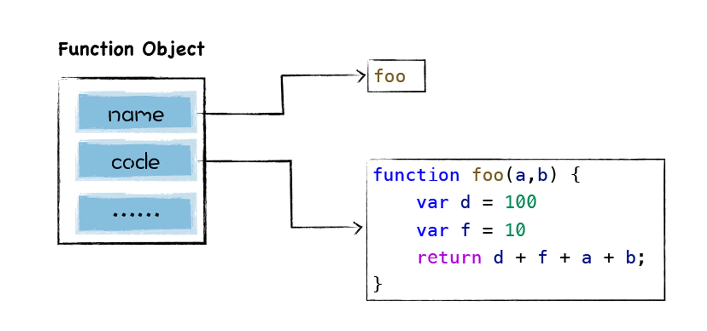

### V8并不会一次将所有js解析为中间代码
主要基于以下两点:   
1. 如果一次解析和编译所有的js代码, 过多的代码会增加编译时间, 这会严重影响到首次执行js代码的速度, 让用户感到卡顿. 因为有时候一个页面的js代码都有10多兆, 如果将所有的代码一次性解析编译完成, 那么会大大增加用户的等待时间;  
2. 解析完成的字节码和编译之后的机器代码都会存放在内存中, 如果一次性解析和编译所有js代码, 那么这些中间代码和机器代码将会一直占用内存.  

基于以上原因, 主流的js虚拟机都实现了**惰性解析**, 所谓惰性解析是指解析器在解析的过程中, 如果遇到函数声明, 那么会跳过函数内部的代码, 并不会为其生成AST和字节码, 而仅仅生成顶层代码的AST和字节码.  
<br>  
### 惰性解析的过程  
```
function foo(a, b) {
    var d = 100;
    var f = 10;
    return d + f + a + b;
}
var a = 1;
var c = 4;
foo(1, 5);
```
当把这段代码交给V8处理时, V8会至上而下解析这段代码, 在解析过程中首先会遇到foo函数, 由于这只是一个函数声明语句, V8在这个阶段只需要将该函数转换为函数对象: 

这里只是将该函数声明转换为函数对象, 但是并没有解析和编译函数内部的代码, 也不会为foo函数的内部代码生成抽象语法树.  

然后继续往下解析, 由于后续的代码都是顶层代码, 所以V8会为它们生成抽象语法树, 最终结果如下所示: 


代码解析完成后, V8便会按照顺序自上而下执行代码, 首先会执行“a=1”和“c=4”这两个赋值表达式, 接下来执行foo函数的调用, 过程是从foo函数对象中取出函数代码, 然后和编译顶层代码一样, V8会先编译foo函数的代码, 编译时同样需要先将其编译为抽象语法树和字节码, 然后再解释执行.  

### 闭包——js的三个特性  
js中闭包有三个基础特性 
1. js语言允许在函数内部定义新的函数
```
function foo() {
    function inner() {

    }
    inner();
}
```
其他大部分语言, 函数只能声明在顶层代码中, 而js中之所以可以在函数中声明另外一个函数, 主要是因为js中的函数即对象, 可以在函数中声明一个变量, 当然也可以在函数中声明一个函数.  
2. 可以在内部函数中访问父函数中定义的变量.  
3. 因为函数是一等公民, 所以函数可以作为返回值.  

### 闭包给惰性解析带来的问题
```
function foo() {
    var d = 20;
    return function inner(a, b) {
        const c = a + b + d;
        return c;
    }
}
const f = foo();
```
- 当调用foo函数时, foo函数会将它的内部函数inner返回给全局变量f;
- foo函数执行结束, 执行上下文被v8销毁;  

 虽然foo函数的执行上下文被销毁了, 但是依然存活的函数inner依然引用foo函数中的变量d, 这会带来两个问题:  
 1. 当foo函数执行结束时, 变量d该不该被销毁? 如果不应该被销毁, 那么应该采取什么策略?  
 2. 如果采用了惰性解析, 那么当执行到foo函数时, V8只会解析foo函数, 并不会解析内部的inner函数, 那么这个时候不知道inner函数中是否引用了foo函数的变量d.   

 在执行foo函数的阶段, 虽然采取了惰性解析, 不会解析和执行foo函数中的inner函数, 但是v8还是需要判断inner函数是否引用了foo函数中的变量, 负责处理这个任务的模块叫做**预解析**, 其主要目的有两个:   
 1. 判断当前函数是不是存在一些语法上的错误. 
 2. 检查函数内部是否引用了外部变量, 如果引用了外部变量, 预解析互器会将栈中的变量复制到堆中, 在下次执行到该函数的时候, 直接使用堆中的引用.  

 
 

