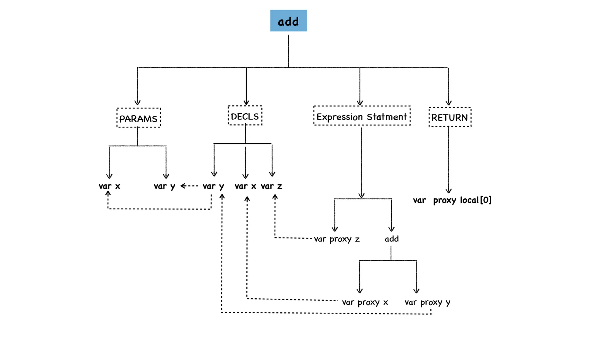
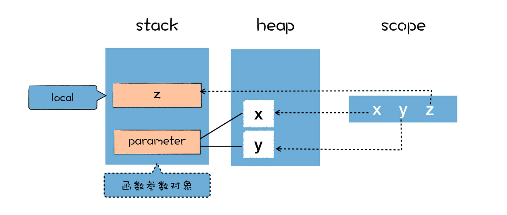
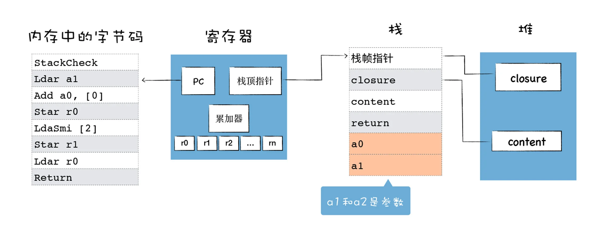

### 如何生成字节码
V8执行一段js代码时, 会先对js代码进行解析(Parser), 并生成为AST和作用域信息, 之后AST和作用域信息被输入到一个称为Ignition的解释器中, 并将其转化为字节码, 之后字节码再由Ignition解释器来解释执行.  
```
funtion add(x, y) {
    var z = x + y;
    return z;
}
console.log(add(1, 2));
```
  
从图中可以看出, 函数的字面量被解析为AST树的形态, 这个函数主要拆分成四部分:   
1. 第一部分为参数的声明(PARAMS), 参数声明中包括了所有的参数, 在这里主要是参数x和参数y;  
2. 第二部分是变量声明节点(DECLS), 参数部分可以使用arguments来调用, 也可以将这些参数作为变量来直接使用, 这体现在DECLS节点下面也出现了变量x和变量y, z变量也在DECLS节点下面. 在上面生成的AST数据中, 参数声明节点中的x和变量声明节点中的x的地址是相同的, 这说明它们指向的是同一块数据.  
3. 第三部分是x+y的表达式节点, 我们可以看到, 节点add下面使用了var proxy x和var proxy y的语法, 它们指向了实际的x和y的值.  
4. 第四部分是RETURN节点, 它指向了z的值, 在这里是local[0].  

作用域中的变量都是未使用的, 默认值都是undefined, 在执行阶段, 作用域中的变量会指向堆和栈中相应的数据, 作用域和实际数据的关系如下图所示:  
  
在解析期间, 所有函数体中声明的变量和函数参数, 都放进作用域中, 如果是普通变量, 那么默认值是undefined, 如果是函数声明, 那么将指向实际的函数对象
<br>  
一旦生成了作用域和AST, V8就可以依据它们来生成字节码了. AST之后会被作为输入传到字节码生成器(BytecodeGenerator), 这是Ignition解释器的一部分, 用于生成以函数为单位的字节码.  

### 解释器的架构设计  
因为解释器就是模拟物理机器来执行字节码的, 比如可以实现如取指令、解析指令、执行指令、存储数据等, 所以解释器的执行架构和CPU处理机器代码的架构类似.  
通常有两种类型的解释器, **基于栈(Stack-based)和基于寄存器(Register-based)**, 基于栈的解释器使用栈来保存函数参数、中间运算结果、变量等, 基于寄存器的虚拟机则支持寄存器的指令操作, 使用寄存器来保存参数、中间计算结果. 

通常, 基于栈的虚拟机也定义了少量的寄存器, 基于寄存器的虚拟机也有堆栈, 其区别体现在它们提供的指令集体系.  

大多数解释器都是基于栈的, 比如JAVA虚拟机, .Net虚拟机, 还有早期的V8虚拟机. 基于堆栈的虚拟机在处理函数调用、解决递归问题和切换上下文时简单明快.  

而现在的V8虚拟机则采用了基于寄存器的设计, 它将一些中间数据保存到寄存器中, 了解这点对于我们分析字节码的执行过程非常重要.  
<br>
基于寄存器的解释器架构:  
  

解释器执行时主要有四个模块, 内存中的字节码、寄存器、栈、堆. 和CPU执行二进制机器代码的模式是类似的: 
- 使用内存中的一块区域来存放字节码;  
- 使用通用寄存器r0、r1、r2....这些寄存器存放中间数据;  
- PC寄存器用来指向下一条要执行的字节码;  
- 栈顶寄存器用来指向当前的栈顶的位置;  

需要注意这里的**累加器**, 是一个非常特殊的寄存器, 用来保存中间的结果, 

代码执行过程:  
1. 参数对象parameter保存在栈中, 包含了a0和a1两个值, 在上面的代码中, 这两个值分别是1和2;  
2. PC寄存器指向了第一个字节码StackCheck, 我们知道, V8在执行一个函数之前, 会判断栈是否会溢出, 这里的StackCheck字节码指令就是检查栈是否达到了溢出的上限, 如果栈增长超过某个阈值, 我们将中止该函数的执行并抛出一个RangeError, 表示栈已溢出.  
3. Ldar a1, 是将a1寄存器中的参数值加载到累加器中, 这时候第一个参数就保存到累加器中了.  
4. 接下来执行加法操作, Add a0, [0], 因为a0是第一个寄存器, 存放了第一个参数, Add a0就是将第一个寄存器中的值和累加器中的值相加, 也就是将累加器中的2和通用寄存器中a0中的1进行相加, 同时将相加后的结果3保存到累加器中. 
5. 累加器中保存了相加后的结果, 然后执行第四段字节码, Star r0, 这是将累加器中的值, 也就是1+2的结果3保存到寄存器r0中, 那么现在寄存器r0中的值就是3了.  
6. 然后将常数2加载到累加器中, 又将累加器中的2加载到寄存器r1中, 我们发现这里两段代码可能没实际用户, 不过V8生成的字节码就是这样. 
7. 最后V8寄存器r0中的值加载到累加器中, 然后执行最后一句Return指令, Return指令会中断当前函数的执行, 并将累加器的值作为返回值.  


