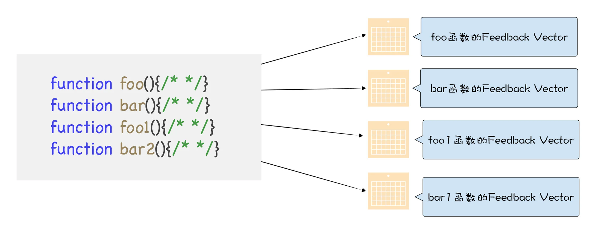

### 内联缓存(Inline Cache), 简称IC
在V8执行函数的过程中, 会观察函数中一些**调用点(CallSite)上的关键的中间数据**, 然后将这些数据缓存起来, 当下次再执行该函数的时候, V8就可以直接利用这些中间数据, 节省了再次获取这些数据的过程, 因此V8利用IC, 可以有效提升一些重复代码的执行效率. 

IC会为每个函数维护一个**反馈向量(FeedBack Vector)**, 反馈向量记录了函数在执行过程中的一些关键的中间数据. 关于函数的反馈向量可以参看下图:  
  
反馈向量其实就是一个表结构, 它由很多项组成, 每一项称为一个**插槽(Slot)**, V8会依次将执行函数的中间数据写入到反馈向量的插槽中.  
```
function loadx(o) {
    o.y = 4;
    return o.x;
}
```
当V8执行这段代码的时候, 它会判断o.y = 4和return o.x这两段是**调用点(CallSite)**, 因为它们使用了对象和属性, 那么V8会在loadx函数的反馈向量中为每个调用点分配一个插槽.  


每个插槽包括了插槽的索引(slot index)、插槽的类型(type)、插槽的状态(state)、隐藏类(map)的地址, 还有属性的偏移量.   


V8除了缓存o.x这种LOAD类型的操作之外, 还会缓存**存储(STORE)类型**和**函数调用(CALL)类型**的中间数据  

当v8再次调用loadX函数的时候, 比如执行到loadx函数的return o.x语句时, 它就会在对应的插槽中查找x属性的偏移量, 之后V8就能直接去内存中获取o.x的属性值了.  
<br>

### 多态和超态
通过缓存执行过程中的基础信息, 能够提升下次执行函数时的效率, 但是这有一个前提, 多次执行时, 对象的形状是固定的; 如果对象的形状不是固定的, 那V8会怎么处理呢?  
```
function loadx(o) {
    return o.x;
}
var o = {
    x: 1,
    y: 3
};
var o1 = {
    x: 3,
    y: 6,
    z: 4
};
for (var i = 0; i < 90000; i++) {
    loadx(o);
    loadx(o1);
}
```
对象o和o1的形状是不同的, 这意味着V8为它们创建的隐藏类是不同的.  


第一次执行loadx时, V8会将o的隐藏类记录在反馈向量中, 并记录属性x的偏移量. 那么当再次调用loadx函数时, v8会取出反馈向量中记录的隐藏类, 并和新的o1的隐藏类进行比较, 发现不是一个隐藏类, 那么此时V8就无法使用反馈向量中记录的偏移量信息了. 

面对这种情况, V8会选择将新的隐藏类也记录在反馈向量中, 同时记录属性值的偏移量, 这时, 反馈向量中的第一个槽里就包含了两个隐藏类和偏移量.

当v8再次执行loadx中的o.x语句时, 同样会查找反馈向量表, 发现第一个槽中记录了两个隐藏类. 这时, V8需要额外做一件事, 拿着新的隐藏类和第一个插槽中的两个隐藏类来一一比较, 如果新的隐藏类和第一个插槽中某个隐藏类相同, 那么就使用该命中的隐藏类的偏移量. 如果没有相同的呢?同样将新的信息添加到反馈向量的第一个插槽中.  

一个反馈向量的一个插槽中可以包含多个隐藏类的信息: 
- 如果一个插槽包含一个隐藏类的信息, 那么我们称这种状态为**单态(monomorphic)**;  
- 如果一个插槽中包含了2~4个隐藏类, 那么我们称这种状态为**多态(polymorphic)**
- 如果一个插槽中超过4个隐藏类, 那么我们称之为**超态(magamorphic)**


如果函数loadx的反馈向量中存在多态或者超态的情况, 其执行效率肯定要低于单态的, 比如当执行到o.x的时候, V8会查询反馈向量的第一个插槽, 发现里面有多个map记录, 那么V8就需要取出o的隐藏类, 来和插槽中记录的隐藏类一一比较, 如果记录的隐藏类越多, 那么比较的次数也就越多, 这就意味着执行效率越低.  
**单态的性能优于多态和超态**  
