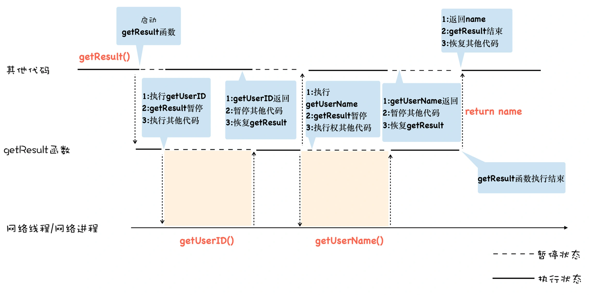

**使用promise可以解决回掉地狱中编码不线性的问题.**  
**使用Generator函数实现更加线性化逻辑**
```
function getResult() {
    let id = getUserID();
    let name = getUserName(id);
    return name;
}
```
由于getUserID和getUserName都是异步请求, 如果要实现这种线性的编码方式, 那么一个可行的方案是**执行到异步请求的时候, 暂停当前函数, 等异步请求返回了结果, 再恢复该函数.**
  
我们可以看出, 这个模型的关键是实现**函数暂停执行**和**函数恢复执行**, 而生成器就是为了实现暂停函数和恢复函数而设计的. 

### 生成器函数
生成器函数是一个带星号的函数, 配合yield就可以实现函数的暂停和恢复:  
```

function* getResult() {

yield 'getUserID'

yield 'getUserName'

return 'name'

}

let result = getResult()

console.log(result.next().value)

console.log(result.next().value)
console.log(result.next().value);
```
执行上面这段代码, 观察输出结果, 发现函数getResult并不是一次执行完的, 而是全局代码和getResult函数交替执行.  


这是生成器函数的特性, 在生成器内部, 如果遇到yield关键字, 那么V8将返回关键字后面的内容给外部, 并暂停该生成器函数的执行. 生成器暂停执行后, 外部的代码便开始执行, 外部代码如果想要恢复生成器的执行, 可以使用result.next方法.  

**V8是实现生成器函数的暂停执行和恢复执行**
这背后的魔法就是**协程, 协程是一种比线程更加轻量级的存在.**可以把协程看成是跑在线程上的任务, 一个线程上可以存在多个协程, 但是在线程上只能执行一个协程. 比如, 当前执行的是A协程, 要启动B协程, 那么A协程就需要将主线程的控制权交给B协程, 这就体现在A协程暂停执行, B协程恢复执行;  
**如果从A协程启动B协程, 我们就把A协程称为B协程的父协程**  
<br>  
正如一个进程可以拥有多个线程一样, 一个线程也可以拥有多个协程. 每一时刻, 该线程只能执行其中某一个协程. 最重要的是, 协程是不被操作系统内核所管理的, 而完全是由程序所控制(也就是在用户态执行). 这样带来的好处就是性能得到了很大的提升, 不会像线程切换那样消耗资源.  

通常, 我们把执行生成器的代码封装成一个函数, 这个函数驱动了getResult函数继续往下执行, 我们把这个执行生成器代码的函数称为**执行器(可参考著名的co框架)**.   

### async/await: 异步编程的“终极”方案  
由于生成器函数可以暂停, 因此我们可以在生成器内部编写完整的异步逻辑代码, 不过生成器依然需要使用额外的co函数来驱动生成器函数的执行, 这一点非常不友好.  

基于这个原因, ES7引入了async/await, 这是js异步编程的一个重大改进, 它改进了生成器的缺点, 提供了在不足塞主线程的情况下使用同步代码实现异步访问资源的能力.   
async/await技术背后的秘密就是promise和生成器应用, 往底层说, 就是微任务和协程应用.

<br>
async是一个通过**异步执行并隐式返回Promise**作为结果的函数.  
这里需要重点关注异步执行这个词, 简单地理解, 如果在async函数里面使用了await, 那么此时async函数就会暂停执行, 并等待合适的时机来恢复执行, 所以说async是一个异步执行的函数.  

**什么时机恢复async函数的执行**
要解释这个问题, 先来看看V8是如何处理await后面的内容的. 
通常await可以等待两种类型的表达式: 
- 任何普通表达式
- promise对象表达式
如果await等待的是一个promise对象, 它就会暂停执行生成器函数, 直到promise对象的状态变成resolve, 才会恢复执行, 然后得到resolve的值, 作为await表达式的运算结果.  

和生成器函数一样, 使用了async声明的函数在执行时, 也是一个单独的线程, 我们可以使用await来暂停该协程, 由于await等待的是一个promise对象, 我们可以resolve来恢复该协程. 

如果await等待的是一个非promise对象, 比如await100, 那么V8会隐式地将await后面的100包装成一个已经resolve的对象. 
